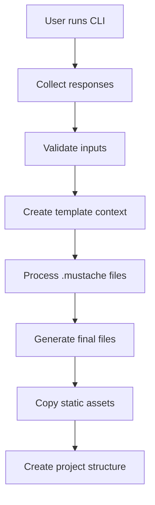

# 🚀 Create Backend Quickstart

> **The Ultimate Production-Ready Backend Generator**

**Create Backend Quickstart** is a comprehensive npm CLI tool that instantly generates fully-featured, production-ready backend applications. No more boilerplate setup - go from idea to working API in under 60 seconds.

## 🎯 **What This Package Does**

This npm package is a **code generator** that creates complete backend projects with:
- **Interactive CLI** that asks what you want
- **Smart templating system** that generates only what you need
- **Production-ready code** following industry best practices
- **Full project structure** with all files and configurations
- **Zero manual setup** - everything works out of the box

[](https://badge.fury.io/js/create-backend-quickstart)
[](https://github.com/your-username/create-backend-quickstart/actions)
[](https://opensource.org/licenses/MIT)

## 📦 **Package Features**

### 🎨 **Interactive CLI Generation**
```bash
npx create-backend-quickstart my-project
```
- **Smart prompts** guide you through configuration
- **Real-time validation** prevents invalid selections
- **Project name sanitization** and conflict detection
- **Feature toggles** - only include what you need
- **Progress indicators** show generation status

### 🎯 **Flexible Project Templates**
- **TypeScript or JavaScript** - your choice
- **4 Database options** - PostgreSQL, MongoDB, MySQL, SQLite
- **Modular features** - authentication, testing, Docker, etc.
- **Production configurations** included
- **Development tools** pre-configured

### 🏗️ **Generated Project Architecture**
Each generated project includes:
- **Express.js** server with middleware stack
- **Domain-Driven Design** folder structure
- **Repository Pattern** for data access
- **Service Layer** for business logic
- **Controller Layer** for request handling
- **Validation Layer** with Joi schemas

### 🗄️ **Database Integration**
- **PostgreSQL** with Sequelize ORM (Production recommended)
- **MongoDB** with Mongoose ODM (NoSQL option)
- **MySQL** with Sequelize ORM (Popular choice)
- **SQLite** with Sequelize ORM (Development friendly)
- **Connection pooling** and error handling
- **Migration scripts** for SQL databases

### 🔐 **Complete Authentication System**
- **JWT access tokens** with configurable expiration
- **Refresh token rotation** for enhanced security
- **Role-Based Access Control (RBAC)** middleware
- **Password hashing** with bcrypt and salt rounds
- **Email verification** workflow
- **Password reset** with secure tokens
- **User registration** with validation

### 🛡️ **Production-Grade Security**
- **Helmet.js** security headers
- **Rate limiting** with configurable windows
- **Input validation** and sanitization
- **XSS protection** and CSRF prevention
- **SQL injection** prevention
- **CORS** configuration
- **Environment variable** validation

### 🧪 **Testing Infrastructure**
- **Jest** testing framework setup
- **Supertest** for HTTP endpoint testing
- **Unit test** examples and structure
- **Integration test** patterns
- **E2E test** configurations
- **Coverage reporting** with thresholds
- **CI/CD** test integration

### 📊 **Observability & Monitoring**
- **Winston logger** with rotation
- **Structured logging** with JSON format
- **Health check** endpoints
- **Error tracking** and reporting
- **Request/Response** logging middleware
- **Performance metrics** collection

### 🐳 **Deployment Ready**
- **Dockerfile** multi-stage builds
- **Docker Compose** for development
- **Production configurations**
- **Environment variable** management
- **PM2** process management
- **Nginx** reverse proxy configuration
- **SSL/TLS** certificate handling

### ⚡ **Developer Experience**
- **Hot reload** development server
- **TypeScript** support with path aliases
- **ESLint + Prettier** code formatting
- **Husky** git hooks for quality gates
- **Lint-staged** pre-commit checks
- **VS Code** configurations included
- **Debug** configurations ready

## ⚡ Latest Updates

### **v1.0.0 - Production Ready** 🎉
- **✅ Bug-Free Templates** - All critical issues resolved
- **✅ Complete API Layer** - Controllers, routes, validators included
- **✅ Working Authentication** - JWT, password reset, email verification
- **✅ Database Models** - Both SQL (Sequelize) and NoSQL (Mongoose)
- **✅ Error Handling** - Comprehensive error middleware
- **✅ Docker Ready** - Fixed deployment configuration
- **✅ Beginner Friendly** - Works out of the box, no configuration needed

## 🚀 **Package Installation & Usage**

### **Installation Methods**

#### Using npx (Recommended)
```bash
# Always get the latest version
npx create-backend-quickstart my-project-name
```

#### Global Installation
```bash
# Install once, use anywhere
npm install -g create-backend-quickstart
create-backend-quickstart my-project-name
```

#### Using Yarn
```bash
yarn create backend-quickstart my-project-name
```

### **CLI Command Options**

```bash
create-backend-quickstart [project-name] [options]
```

**Available Options:**
```bash
-V, --version          Display version number
-h, --help             Display help information
-f, --force            Overwrite existing directory
-y, --yes              Skip all prompts, use defaults
-d, --dir <path>       Custom output directory
--verbose              Show detailed generation logs
--dry-run              Preview what will be generated without creating files
```

**Examples:**
```bash
# Basic usage
npx create-backend-quickstart my-api

# Force overwrite existing directory
npx create-backend-quickstart my-api --force

# Use all defaults without prompts
npx create-backend-quickstart my-api --yes

# Custom output directory
npx create-backend-quickstart my-api --dir ./custom/path

# Preview without creating files
npx create-backend-quickstart my-api --dry-run
```

## 🎮 **Quick Start Demo**

### **60-Second Setup**
```bash
# 1. Generate project (30 seconds)
npx create-backend-quickstart my-awesome-api
cd my-awesome-api

# 2. Install & start (30 seconds)
npm install && npm run dev

# ✅ Working API server at http://localhost:3000
```

## 📋 Complete Step-by-Step Guide

### Step 1: Generate Your Project
```bash
# Create a new backend project
npx create-backend-quickstart my-awesome-api
```

### Step 2: Navigate to Project Directory
```bash
cd my-awesome-api
```

### Step 3: Install Dependencies
```bash
# Install all required packages
npm install
```

### Step 4: Set Up Environment Variables
```bash
# Copy the example environment file
cp .env.example .env

# Edit the .env file with your settings
# For beginners: the defaults work fine for development
```

**Important Environment Variables:**
```bash
# Database (choose one based on your selection)
DB_HOST=localhost
DB_PORT=5432  # 5432 for PostgreSQL, 27017 for MongoDB, 3306 for MySQL
DB_NAME=my_awesome_api
DB_USERNAME=postgres  # Not needed for MongoDB/SQLite
DB_PASSWORD=password   # Not needed for MongoDB/SQLite

# JWT Secrets (CHANGE THESE IN PRODUCTION!)
JWT_SECRET=your-super-secret-jwt-key-change-in-production
JWT_REFRESH_SECRET=your-refresh-secret-change-in-production
```

### Step 5: Set Up Your Database

#### For PostgreSQL:
```bash
# Install PostgreSQL on your system
# macOS:
brew install postgresql
brew services start postgresql

# Create database
createdb my_awesome_api

# Run migrations (if using SQL database)
npm run migrate
```

#### For MongoDB:
```bash
# Install MongoDB on your system
# macOS:
brew install mongodb/brew/mongodb-community
brew services start mongodb-community

# No migrations needed - MongoDB creates collections automatically
```

#### For MySQL:
```bash
# Install MySQL on your system
# macOS:
brew install mysql
brew services start mysql

# Create database
mysql -u root -p -e "CREATE DATABASE my_awesome_api;"

# Run migrations
npm run migrate
```

#### For SQLite (Easiest for beginners):
```bash
# Nothing to install - SQLite file will be created automatically
# Perfect for learning and development

# Run migrations
npm run migrate
```

### Step 6: Start Development Server
```bash
# Start the server with hot reload
npm run dev
```

**You should see:**
```
🚀 Server running on 0.0.0.0:3000
📖 API Documentation: http://0.0.0.0:3000/api-docs  
🏥 Health Check: http://0.0.0.0:3000/health
🌍 Environment: development
```

### Step 7: Test Your API

#### Health Check
```bash
curl http://localhost:3000/health
```

#### Register a New User
```bash
curl -X POST http://localhost:3000/api/v1/auth/register \
  -H "Content-Type: application/json" \
  -d '{
    "email": "test@example.com",
    "password": "TestPassword123",
    "firstName": "John",
    "lastName": "Doe"
  }'
```

#### Login
```bash
curl -X POST http://localhost:3000/api/v1/auth/login \
  -H "Content-Type: application/json" \
  -d '{
    "email": "test@example.com",
    "password": "TestPassword123"
  }'
```

### Step 8: Explore API Documentation
Visit: **http://localhost:3000/api-docs**

This opens the interactive Swagger documentation where you can:
- See all available endpoints
- Test API calls directly from the browser
- Understand request/response formats

### Step 9: Development Workflow

#### Make Changes and See Them Live
```bash
# Server automatically restarts when you save files
# Edit files in src/ directory
# Changes appear immediately
```

#### Run Tests
```bash
npm test              # Run all tests
npm run test:watch    # Run tests in watch mode
npm run test:coverage # Generate coverage report
```

#### Code Quality
```bash
npm run lint          # Check code style
npm run lint:fix      # Fix code style issues
npm run format        # Format code with Prettier
```

### Step 10: Production Deployment

#### Build for Production (TypeScript projects)
```bash
npm run build
```

#### Start Production Server
```bash
npm start
```

#### Using Docker
```bash
# Build and start with Docker
npm run docker:build
npm run docker:up

# Your API will be available at http://localhost:3000
```

## 🎯 What You Get After Setup

✅ **Working API Server** running on http://localhost:3000  
✅ **Interactive Documentation** at http://localhost:3000/api-docs  
✅ **Authentication System** ready to use  
✅ **Database Connected** and ready for data  
✅ **Hot Reload** for instant development feedback  
✅ **Testing Suite** ready to run  
✅ **Docker Ready** for easy deployment  

## 🚨 Common Issues & Solutions

### "Database connection failed"
```bash
# Make sure your database is running
# PostgreSQL:
brew services restart postgresql

# MongoDB:  
brew services restart mongodb-community

# MySQL:
brew services restart mysql

# Check your .env file has correct database credentials
```

### "Port 3000 already in use"
```bash
# Kill process using port 3000
lsof -ti:3000 | xargs kill -9

# Or change port in .env file
PORT=3001
```

### "npm run migrate fails"  
```bash
# Make sure database exists and credentials are correct
# For PostgreSQL:
createdb your_database_name

# For MySQL:
mysql -u root -p -e "CREATE DATABASE your_database_name;"
```

## 🎯 **Interactive CLI Experience**

When you run the command, you'll be guided through an interactive setup:

### **CLI Prompts Flow**

```bash
🚀 Welcome to Backend Quickstart Generator!

┌─────────────────────────────────────────────────┐
│                PROJECT DETAILS                  │
└─────────────────────────────────────────────────┘
? Project name: my-awesome-api
? Project description: A production-ready backend API  
? Author name: John Doe
? License: MIT

┌─────────────────────────────────────────────────┐
│              TECHNOLOGY STACK                   │
└─────────────────────────────────────────────────┘
? Use TypeScript? (Y/n) Yes
? Choose database:
  ❯ PostgreSQL (SQL - Recommended)
    MongoDB (NoSQL - Popular) 
    MySQL (SQL)
    SQLite (Development only)

┌─────────────────────────────────────────────────┐
│                  FEATURES                       │
└─────────────────────────────────────────────────┘
? Include JWT authentication system? (Y/n) Yes
? Include Swagger/OpenAPI documentation? (Y/n) Yes
? Include testing setup (Jest + Supertest)? (Y/n) Yes
? Include Docker configuration? (Y/n) Yes
? Include Redis for caching and sessions? (Y/n) Yes
? Include WebSocket support (Socket.io)? (y/N) No
? Include background job processing (Bull)? (Y/n) Yes
? Include CORS middleware? (Y/n) Yes
? Include rate limiting? (Y/n) Yes
? Include monitoring and health checks? (Y/n) Yes

┌─────────────────────────────────────────────────┐
│              CONFIGURATION SUMMARY              │
└─────────────────────────────────────────────────┘
📦 Project: my-awesome-api
📝 Description: A production-ready backend API
👤 Author: John Doe
📜 License: MIT
⚡ TypeScript: Yes
🗄️ Database: POSTGRESQL
🎯 Features: authentication, swagger, testing, docker, 
           redis, backgroundJobs, cors, rateLimit, monitoring

? Proceed with project generation? (Y/n) Yes

┌─────────────────────────────────────────────────┐
│               GENERATING PROJECT                │
└─────────────────────────────────────────────────┘
✨ Creating project structure...
📁 Setting up directories...
📄 Generating configuration files...
🎨 Creating TypeScript templates...
🗄️ Setting up PostgreSQL integration...
🔐 Configuring JWT authentication...
🧪 Setting up testing framework...
🐳 Creating Docker configuration...
📖 Generating API documentation...

✅ Project created successfully!

┌─────────────────────────────────────────────────┐
│                 NEXT STEPS                      │
└─────────────────────────────────────────────────┘
cd my-awesome-api
npm install
cp .env.example .env
npm run dev

🚀 Your API will be running at http://localhost:3000
📖 API docs available at http://localhost:3000/api-docs
```

### **Smart Validation & Hints**

The CLI includes helpful validation and suggestions:

```bash
? Project name: my awesome api!
❌ Invalid characters. Use lowercase letters, numbers, and hyphens only.
? Project name: my-awesome-api ✅

? Choose database: PostgreSQL
💡 Great choice! PostgreSQL is recommended for production apps.
   Includes: Connection pooling, migrations, ACID compliance

? Include background job processing? Yes  
💡 Bull will be configured with Redis for reliable job queuing.
   Perfect for: Email sending, image processing, scheduled tasks
```

### **Project Generation Progress**

Watch your project come to life in real-time:

```bash
Creating project structure...
├── 📁 src/
│   ├── 📁 api/v1/
│   │   ├── 📄 routes/auth.ts ✅
│   │   ├── 📄 routes/users.ts ✅
│   │   ├── 📄 controllers/AuthController.ts ✅
│   │   └── 📄 controllers/UserController.ts ✅
│   ├── 📁 core/
│   │   ├── 📄 database/connection.ts ✅
│   │   ├── 📄 database/models/User.ts ✅
│   │   └── 📄 utils/logger.ts ✅
│   ├── 📄 app.ts ✅
│   └── 📄 server.ts ✅
├── 📁 tests/ ✅
├── 📄 package.json ✅
├── 📄 Dockerfile ✅
├── 📄 docker-compose.yml ✅
└── 📄 README.md ✅

🎉 Generated 47 files in 2.3 seconds!
```

## 📁 Project Structure

```
my-awesome-api/
├── 📄 README.md                 # Project documentation
├── 📄 package.json             # Dependencies and scripts
├── 📄 .env.example             # Environment variables template
├── 📄 .gitignore               # Git ignore rules
├── 📄 Dockerfile               # Docker container config
├── 📄 docker-compose.yml       # Multi-container setup
├── 📄 jest.config.js           # Test configuration
├── 📄 .eslintrc.js             # Code linting rules
├── 📄 .prettierrc              # Code formatting rules
│
├── 📁 src/                     # Application source code
│   ├── 📄 app.ts               # Express app configuration
│   ├── 📄 server.ts            # Server startup
│   │
│   ├── 📁 api/                 # API routes and controllers
│   │   ├── 📁 controllers/     # Request handlers
│   │   ├── 📁 routes/          # Route definitions
│   │   └── 📁 middleware/      # Route-specific middleware
│   │
│   ├── 📁 core/                # Core business logic
│   │   ├── 📁 services/        # Business logic services
│   │   ├── 📁 database/        # Database connections & models
│   │   ├── 📁 auth/            # Authentication logic
│   │   └── 📁 utils/           # Utility functions
│   │
│   ├── 📁 config/              # Configuration management
│   │   ├── 📄 index.ts         # Main config file
│   │   └── 📄 database.ts      # Database configuration
│   │
│   └── 📁 types/               # TypeScript type definitions
│
├── 📁 tests/                   # Test files
│   ├── 📁 unit/                # Unit tests
│   ├── 📁 integration/         # Integration tests
│   └── 📁 e2e/                 # End-to-end tests
│
├── 📁 docs/                    # Documentation
│   ├── 📄 api.md               # API documentation
│   └── 📄 deployment.md       # Deployment guide
│
└── 📁 scripts/                 # Build and deployment scripts
```

## 🔧 Available Commands

### Development
```bash
npm run dev          # Start development server with hot reload
npm run build        # Build TypeScript to JavaScript
npm run start        # Start production server
```

### Database (SQL databases)
```bash
npm run migrate      # Run database migrations
npm run migrate:undo # Undo last migration
npm run seed         # Run database seeders
```

### Testing
```bash
npm test             # Run all tests
npm run test:unit    # Run unit tests only
npm run test:integration # Run integration tests
npm run test:e2e     # Run end-to-end tests
npm run test:coverage # Generate test coverage report
```

### Code Quality
```bash
npm run lint         # Check code style
npm run lint:fix     # Fix code style issues
npm run format       # Format code with Prettier
```

### Docker
```bash
npm run docker:build # Build Docker image
npm run docker:up    # Start with Docker Compose
npm run docker:down  # Stop Docker containers
```

## 🗄️ Database Configuration

### PostgreSQL (Recommended)
```typescript
// config/database.ts
export const config = {
  database: {
    dialect: 'postgres',
    host: process.env.DB_HOST || 'localhost',
    port: parseInt(process.env.DB_PORT || '5432'),
    name: process.env.DB_NAME || 'myapp',
    username: process.env.DB_USERNAME || 'postgres',
    password: process.env.DB_PASSWORD || 'password'
  }
};
```

### MongoDB
```typescript
// MongoDB connection automatically handled
// Just set these environment variables:
DB_HOST=localhost
DB_PORT=27017
DB_NAME=myapp
```

## 🔐 Authentication System

### JWT Authentication
```typescript
// Login endpoint
POST /api/auth/login
{
  "email": "user@example.com",
  "password": "securepassword"
}

// Response
{
  "success": true,
  "data": {
    "user": { ... },
    "accessToken": "eyJ...",
    "refreshToken": "eyJ..."
  }
}
```

### Protected Routes
```typescript
// Use the auth middleware
import { authenticate, authorize } from './middleware/auth';

router.get('/admin', authenticate, authorize(['admin']), controller.adminOnly);
```

## 🛡️ Security Features

- **Rate Limiting**: 100 requests per 15 minutes per IP
- **CORS**: Configurable cross-origin resource sharing
- **Helmet**: Security headers (XSS, CSRF, etc.)
- **Input Validation**: Joi schema validation
- **Password Hashing**: bcryptjs with configurable rounds
- **JWT Security**: Secure token generation and validation

## 📊 API Documentation

### Swagger/OpenAPI
Access interactive API documentation at `http://localhost:3000/api-docs`

### Health Check
```bash
GET /health
# Returns system status and database connectivity
```

### Example API Endpoints
```bash
# Authentication
POST /api/auth/register    # User registration
POST /api/auth/login       # User login
POST /api/auth/refresh     # Refresh access token
POST /api/auth/logout      # User logout

# User Management
GET    /api/users          # List users (admin only)
GET    /api/users/profile  # Get user profile
PUT    /api/users/profile  # Update user profile
DELETE /api/users/:id      # Delete user (admin only)

# Health & Monitoring
GET /health               # System health check
GET /health/detailed      # Detailed health information
```

## 🧪 Testing

### Test Structure
```bash
tests/
├── unit/           # Fast, isolated unit tests
├── integration/    # Database and service integration
└── e2e/           # Full API endpoint testing
```

### Example Test
```typescript
describe('User Authentication', () => {
  it('should login with valid credentials', async () => {
    const response = await request(app)
      .post('/api/auth/login')
      .send({
        email: 'test@example.com',
        password: 'password123'
      });
      
    expect(response.status).toBe(200);
    expect(response.body.success).toBe(true);
    expect(response.body.data.accessToken).toBeDefined();
  });
});
```

## 🐳 Docker Deployment

### Development
```bash
docker-compose up -d
```

### Production
```bash
docker build -t my-api .
docker run -p 3000:3000 --env-file .env my-api
```

### Environment Variables
```bash
# Server
NODE_ENV=production
PORT=3000
HOST=0.0.0.0

# Database
DB_HOST=localhost
DB_PORT=5432
DB_NAME=myapp
DB_USERNAME=postgres
DB_PASSWORD=secretpassword

# Authentication
JWT_SECRET=your-super-secret-jwt-key
JWT_REFRESH_SECRET=your-refresh-secret-key
JWT_EXPIRES_IN=15m
JWT_REFRESH_EXPIRES_IN=7d

# Redis (if enabled)
REDIS_HOST=localhost
REDIS_PORT=6379
REDIS_PASSWORD=

# Email (if enabled)
EMAIL_HOST=smtp.gmail.com
EMAIL_PORT=587
EMAIL_USER=your-email@gmail.com
EMAIL_PASS=your-app-password
```

## 🏭 Production Checklist

- [ ] Set strong JWT secrets
- [ ] Configure database connection pooling
- [ ] Set up SSL/TLS certificates
- [ ] Configure reverse proxy (nginx)
- [ ] Set up monitoring and logging
- [ ] Configure automated backups
- [ ] Set up CI/CD pipeline
- [ ] Configure environment variables
- [ ] Set up error tracking (Sentry)
- [ ] Configure rate limiting
- [ ] Set up health checks

## 🤝 Contributing

We welcome contributions! Please see our [Contributing Guide](CONTRIBUTING.md) for details.

### Development Setup
```bash
git clone https://github.com/your-username/create-backend-quickstart.git
cd create-backend-quickstart
npm install
npm run build
npm link

# Test the CLI
create-backend-quickstart test-project
```

## 📈 Performance

- **Startup Time**: < 2 seconds
- **Memory Usage**: ~50MB baseline
- **Request Handling**: 1000+ req/sec on single core
- **Database Connections**: Pooled connections
- **Caching**: Redis integration available

## 🏗️ **Package Architecture**

### **Template System**
The package uses a sophisticated template system powered by **Mustache.js**:

```
create-backend-quickstart/
├── 📁 src/
│   ├── 📁 cli/                 # Interactive CLI logic
│   │   ├── 📄 index.ts         # Main CLI entry point
│   │   └── 📄 prompts.ts       # Question definitions
│   ├── 📁 generators/          # Template processing
│   │   ├── 📄 index.ts         # Core generation logic
│   │   └── 📄 fileProcessor.ts # File template rendering
│   ├── 📁 utils/               # Utility functions
│   │   ├── 📄 validation.ts    # Input validation
│   │   └── 📄 fileSystem.ts    # File operations
│   └── 📁 types/               # TypeScript interfaces
│       └── 📄 index.ts         # Type definitions
│
├── 📁 templates/               # Project templates
│   ├── 📄 package.json.mustache     # Dynamic package.json
│   ├── 📄 _env.example.mustache     # Environment variables
│   ├── 📄 Dockerfile.mustache       # Docker configuration
│   └── 📁 src/                      # Application templates
│       ├── 📄 app.ts.mustache       # Express app setup
│       ├── 📄 server.ts.mustache    # Server entry point
│       ├── 📁 api/v1/               # API layer templates
│       ├── 📁 core/                 # Core logic templates
│       └── 📁 shared/               # Shared utilities
│
└── 📁 tests/                   # Package tests
    ├── 📁 unit/                # Unit tests for CLI
    └── 📁 integration/         # Template generation tests
```

### **Smart Template Conditionals**
Templates use intelligent conditionals based on user choices:

```mustache
{{#typescript}}
import { Request, Response } from 'express';
{{/typescript}}
{{^typescript}}
const express = require('express');
{{/typescript}}

{{#authentication}}
// JWT authentication routes
router.post('/login', authController.login);
{{/authentication}}

{{#mongodb}}
import User from '../models/UserMongo';
{{/mongodb}}
{{^mongodb}}
import { User } from '../models/User';
{{/mongodb}}
```

### **Extensible Design**
The package is designed for easy extension:

#### **Adding New Databases**
1. Create connection template in `templates/src/core/database/`
2. Add model templates for the new database
3. Update CLI prompts in `src/cli/prompts.ts`
4. Add conditional dependencies in `package.json.mustache`

#### **Adding New Features**
1. Create feature templates in appropriate directories
2. Add CLI prompts for feature configuration
3. Update template conditionals with `{{#featureName}}`
4. Add feature-specific dependencies and scripts

#### **Custom Middleware**
1. Create middleware templates in `templates/src/shared/middlewares/`
2. Add configuration options to CLI prompts
3. Include middleware in app setup conditionally

### **Template Processing Flow**



## 🛠️ **Package Development**

### **Contributing to Templates**
Want to improve the generated projects? Here's how:

```bash
# Clone the package repository
git clone https://github.com/your-username/create-backend-quickstart.git
cd create-backend-quickstart

# Install dependencies
npm install

# Link for local testing
npm link

# Test your changes
create-backend-quickstart test-project

# Run package tests
npm test
```

### **Template Development Guidelines**

1. **Use meaningful conditionals**:
   ```mustache
   {{#database_postgresql}}
   // PostgreSQL specific code
   {{/database_postgresql}}
   ```

2. **Include helpful comments**:
   ```mustache
   {{#authentication}}
   // JWT middleware for protected routes
   router.use('/protected', authenticate);
   {{/authentication}}
   ```

3. **Maintain consistency**:
   - Use same code style across templates
   - Follow TypeScript/JavaScript best practices
   - Include proper error handling

### **Testing Templates**
The package includes comprehensive tests:

```bash
npm run test:templates    # Test template generation
npm run test:cli         # Test CLI interactions  
npm run test:integration # Test full project generation
npm run test:e2e        # Test generated project functionality
```

## 📚 Resources

- [Express.js Documentation](https://expressjs.com/)
- [TypeScript Handbook](https://www.typescriptlang.org/docs/)
- [PostgreSQL Documentation](https://www.postgresql.org/docs/)
- [MongoDB Documentation](https://docs.mongodb.com/)
- [JWT Introduction](https://jwt.io/introduction)
- [Docker Documentation](https://docs.docker.com/)

## 🐛 Troubleshooting

### Common Issues

**Port already in use**
```bash
# Find and kill process using port 3000
lsof -ti:3000 | xargs kill -9
```

**Database connection failed**
- Check database server is running
- Verify connection credentials
- Ensure database exists

**TypeScript compilation errors**
```bash
npm run build:watch  # Watch for TypeScript errors
```

**Tests failing**
```bash
npm run test:verbose  # Run tests with detailed output
```

## 📝 License

This project is licensed under the MIT License - see the [LICENSE](LICENSE) file for details.

## ⭐ Support

If this project helped you, please consider giving it a ⭐ on GitHub!

---

**Made with ❤️ by developers, for developers**

*Create Backend Quickstart - From idea to production in minutes, not hours.*